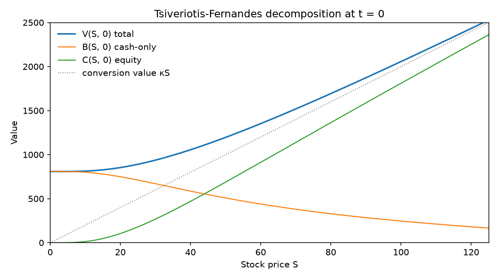
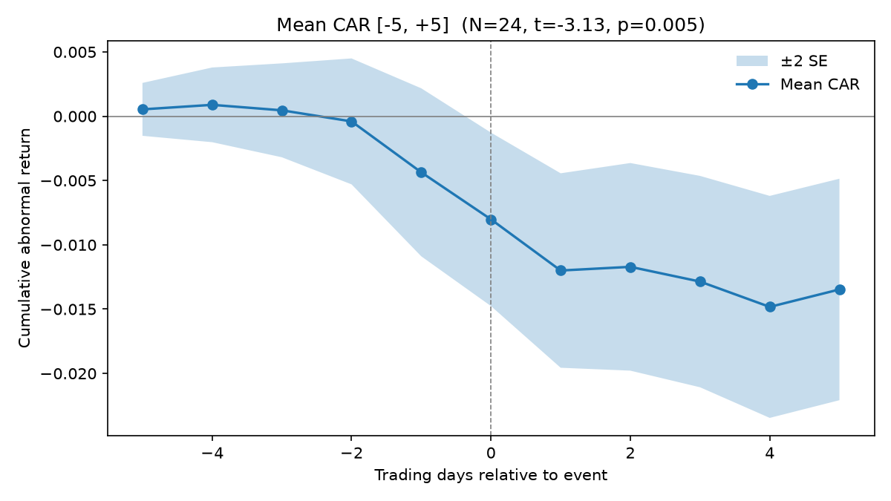

# Convertible Bond Valuation & TRACE Event-Study Engine

A Python engine I built as part of my undergraduate research in empirical corporate finance. It has two pillars: a **Tsiveriotis–Fernandes PDE solver** for pricing convertible bonds with credit risk, and an **event-study pipeline** for measuring price pressure around convertible debt issuance using TRACE-style transaction data.

Everything is object-oriented, strictly typed, and verified by a synthetic test harness (22 tests, all strict — no skips or expected failures).

## Pillar 1 — Valuation: the Tsiveriotis–Fernandes PDE

Convertible bonds are hybrid securities: part corporate debt, part equity call option. Tsiveriotis & Fernandes (1998) price them by splitting the value into components with different credit exposure,

$$V(S,t) = B(S,t) + C(S,t)$$

where the *cash-only* component $B$ (coupons and redemption, paid in cash) is discounted at the risky rate $r + r_c$, while the *equity* component $C = V - B$ (value delivered in shares) is discounted at the risk-free rate $r$. The two coupled parabolic PDEs are solved backward from maturity with a **Crank–Nicolson finite-difference scheme** (tridiagonal systems via `scipy.linalg.solve_banded`), with an American-style projection each step for conversion, call, and put rights.

Boundary conditions, which the test suite enforces directly:

| Boundary | Condition |
|---|---|
| $S \to 0$ | Pure risky debt: PV of cash flows at $r + r_c$, floored at recovery $R \cdot F$ |
| $S \to \infty$ | Certain conversion: $V = \kappa S$, cash component extinguished ($B = 0$) |
| $t = T$ | $V = \max(F + c_T,\ \kappa S)$ — redeem or convert |



The engine also exports an interactive Plotly visualizer (`models/visualizer.py`) with a time-step scrubber, so you can watch $V$, $B$, and $C$ diffuse backward from the terminal payoff kink. The HTML files are self-contained and excluded from the repo for size — regenerate them with the demo script below.

## Pillar 2 — Empirics: TRACE cleaning, event study, price pressure

- **`pipeline/trace_cleaner.py`** — a Dick-Nielsen-style filter cascade for corporate bond transaction data: cancel/reversal matching, inter-dealer de-duplication, median price-deviation screens, liquidity cuts, and yield-to-maturity spreads solved against an interpolated Treasury curve.
- **`pipeline/event_study.py`** — a MacKinlay-standard market-model event study: OLS betas over a $[-120, -21]$ estimation window, abnormal returns over $[-5, +5]$ around issuance, cumulative abnormal returns (CAR) with cross-sectional inference.
- **`backtest/price_pressure.py`** — cross-sectional regression of event CARs on short-interest spikes (the convertible-arbitrage delta-hedging proxy) with HC1 or issuer-clustered standard errors, plus a reversal-window specification to separate transitory pressure from information effects.



## Quickstart

```bash
pip install -r requirements.txt

# run the test harness (22 strict tests)
python -m pytest tests/test_synthetic_harness.py -v

# run the full end-to-end demo on synthetic data
python run_pipeline_demo.py
```

The demo prices a 5-year semi-annual convertible, cleans a mock TRACE log with injected data pathologies, detects deliberately injected price pressure in the event study (t = −3.13 on the seeded data), and recovers a negative pressure coefficient in the regression with the expected sign flip in the reversal window. Exit code 0 means every stage verified.

## Testing philosophy

The harness in `tests/test_synthetic_harness.py` was written *before* the solver internals, locking down the mathematical boundary contract as no-arbitrage identities: the $S = 0$ value can never price below default recovery, the truncation edge must price as pure conversion, the zero-conversion limit must reproduce the closed-form risky-bond PV within 0.5%, and the solved surface must dominate conversion value everywhere. The event engine is tested by generating returns *exactly* from a known market model and requiring it to recover the true beta. All synthetic data is seeded and reproducible.

## Project structure

```
├── models/               # TF PDE solver + interactive grid visualizer
├── pipeline/             # TRACE cleaning + event study
├── backtest/             # price-pressure regressions
├── tests/                # synthetic self-verification harness
├── outputs/              # generated figures
└── run_pipeline_demo.py  # end-to-end validation of all four stages
```

## References

- Tsiveriotis, K., and C. Fernandes (1998). "Valuing Convertible Bonds with Credit Risk." *Journal of Fixed Income* 8(2), 95–102.
- Dick-Nielsen, J. (2009, 2014). Liquidity filters for TRACE data.
- MacKinlay, A. C. (1997). "Event Studies in Economics and Finance." *Journal of Economic Literature* 35(1), 13–39.

---

*Note: `README_vault.md` is the Obsidian-facing version of this document; its `[[wikilinks]]` resolve inside my research vault, not on GitHub.*
